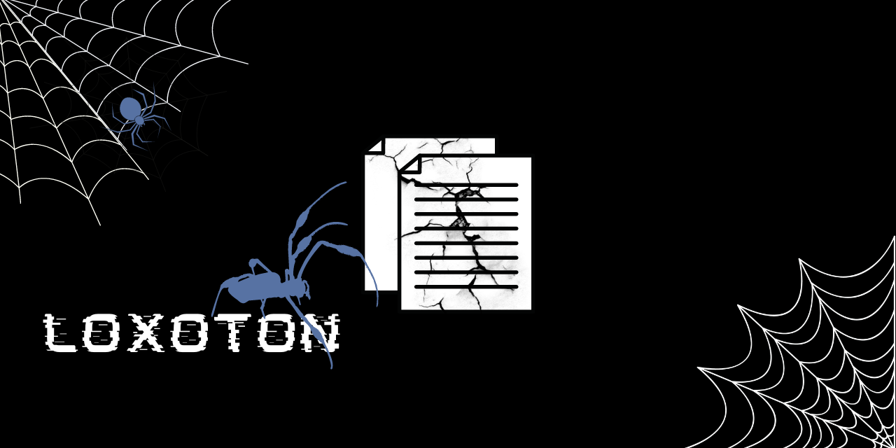

# loxoten :spider:

`loxoten` is a command line tool that corrupts files.

##  _:exclamation: Warning :exclamation:_
This project is _strictly for educational/research purposes_, any malicious activities that involve use of this repository is not the responsibility of the owner.
**:zap: Ignore at your own risk! :zap:**.


# Installation

For linux/UNIX/OSx systems:

First clone the git repository
```console
$ git clone https://github.com/NovusEdge/loxoten
```

Run CMake to build the binary:
```console
$ cd loxoten
$ make
```

Make builds the binary in `loxoten/bin/`

```console
$ ls bin/
loxoten
```

# Usage

```console
$ ./bin/loxoten --help
USAGE:
    loxoten [flags] [files]

OPTIONS:
        -V  --version       Print the version loxoten-cli
        -v  --verbose       Use verbose output
        -q  --quiet         Use quiet mode to suppress output.
        -h  --help          Prints help information
        -n  --num-bytes     Specifies the number of bytes to write to the given
                            files.
```

For more information, check the project wiki

## License :scroll:
This project is licensed under the CC-BY-4.0 License. Please see [License File](LICENSE) for more information.


***Name Inspiration***: Loxosceles tenochtitlan
